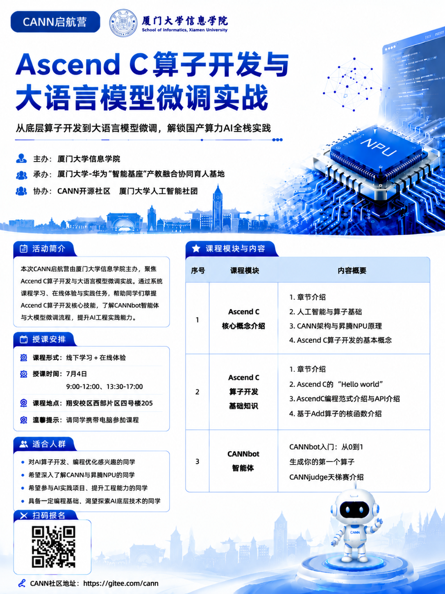

# 2026-07-04：参加 CANN 启航营

今天参加了厦门大学信息学院的 **CANN 启航营：Ascend C 算子开发与大语言模型微调实战**。



这次活动的时间是 7 月 4 日，上午 9:00-12:00，下午 13:30-17:00。课程形式是线下学习加在线体验，地点在翔安校区西部片区四号楼 205。

从海报上的课程安排看，今天的主线很清楚：先理解 Ascend C 和 CANN 的基本概念，再从 Hello World、Add 算子和 API 调用进入算子开发，最后接到 CANNBot 智能体和 CANNJudge 练习平台。

## 今天接触到的内容

### Ascend C 和 CANN 基础

活动前半部分主要是在建立背景。

CANN 是昇腾 AI 计算的软件栈，Ascend C 是面向昇腾 NPU 做算子开发的重要入口。今天重新把几个概念连起来了：

- AI 计算不是只写 Python 调模型，底层还有算子、内存、并行和硬件执行单元
- NPU 和 GPU 一样都是加速器，但软件栈、编程模型和调优方式不同
- Ascend C 的学习重点不是语法本身，而是理解数据怎么搬、怎么切、怎么在 AI Core 上计算
- 算子开发要同时关心功能正确性和性能

我之前对“算子”这个词的理解还比较抽象，今天更具体了一点：模型里的很多操作，最后都要落到具体算子上。算子写得好不好，会影响推理、训练和大模型微调的效率。

### 第一个算子

课程里提到 Ascend C 的 “Hello World”，以及基于 Add 算子的核函数介绍。

这部分对我来说最有用的是把“算子开发”拆成了几个步骤：

1. 明确输入、输出和数据类型。
2. 理解数据在 Global Memory 和 Local Memory 之间的流动。
3. 写核函数，把计算逻辑放到设备侧。
4. 编译、运行、验证结果。
5. 再考虑性能优化。

现在还谈不上真正掌握 Ascend C，但至少知道了入口在哪。后面如果继续学，应该先把 Add 这种最小例子跑通，再看 Vector 算子、Cube 算子和融合算子。

## 今天用到的资料入口

### cann-learning-hub

[cann-learning-hub](https://gitcode.com/cann/cann-learning-hub) 是今天最重要的资料入口。

我看了它的 README，仓库定位是 CANN 生态的开源学习中心，里面把快速入门、开发教程、参考实践、技术博客和社区贡献放在一起。它不是单篇教程，而是更像一张地图。

目前里面对我最相关的部分是：

- `quick_start/cann_basics`：人工智能基础、什么是 NPU、什么是 CANN、NPU 加法
- `quick_start/first_custom_operator`：第一个自定义算子
- `quick_start/first_operator_api_call`：第一次调用算子 API
- `tutorials/ascendc_operator_development`：Ascend C 算子开发系列
- `skills/`：CANNBot 相关技能，包括 CANNJudge 提交和自定义算子工程生成

README 里还把学习链路总结成“学、练、赛”：先看教程，再去 CANNJudge 刷题或用 CANNLab 实验，最后通过比赛验证。

这个思路对我挺有用。只看文档很容易停在概念层，CANNJudge 和比赛能逼着我把代码写出来。

### 讨论贴和 D1 开发者

今天也看了 CANN 启航营相关的[讨论贴](https://gitcode.com/cann/cann-launch-camp/issues/3)。

这个链接后面要继续跟进。按今天活动里的说明，大家可以参与相关讨论和任务，后续有机会转化为 D1 开发者。对我来说，这比单纯听课更有吸引力，因为它给了一个社区身份和持续参与入口。

后面要做的不是只收藏链接，而是把学习记录、练习题、踩坑和代码提交都整理出来。社区贡献最终还是要落到具体内容上。

### Ascend C SIMD API 文档

今天还打开了昇腾社区的 [Ascend C SIMD API 列表](https://www.hiascend.com/document/detail/zh/CANNCommunityEdition/910beta3/API/ascendcopapi/atlasascendc_api_07_11094.html)。

这份文档对应 CANN 社区版 9.1.0-beta.3，页面里按类别列出了 Ascend C 的 API。里面能看到很多以后会用到的方向：

| 类别 | 例子 |
| --- | --- |
| 数据搬运 | Memory 数据搬运 API |
| 矢量计算 | Memory 矢量计算 API |
| 数学计算 | 基础数学类 API |
| 张量变换 | Pad、UnPad、Fill 等 |
| 索引计算 | `Arange` |
| 矩阵计算 | `Matmul` |
| 通信 | HCCL 通信类 |
| 卷积 | `Conv3D`、反向卷积相关接口 |
| 随机函数 | `PhiloxRandom` |

我现在还没法直接使用这些 API，但它让我看到 Ascend C 不是只写一个核函数那么简单。算子开发会牵涉数据搬运、内存布局、数学计算、矩阵乘、通信和调试。

## CANNBot Skills

[CANNBot Skills](https://gitcode.com/cann/cannbot-skills) 是今天看到的另一个重要项目。

它的定位是面向 CANN 开发的智能体技能集合，覆盖 Ascend C、Catlass、PyPTO、TileLang、Triton 算子开发，torch.compile 图模式优化，NPU 模型推理端到端优化和 Runtime 适配等场景。

我比较关注它的三层结构：

- **Plugin**：应用编排层，定义开发流程
- **Agent**：角色执行层，负责方案设计、代码开发、代码检视和测试
- **Skill**：知识能力层，提供领域知识和工程模板

这和我之前理解的 AI 编程有点不一样。不是让一个大模型直接乱写代码，而是把开发任务拆成角色、流程和技能。尤其是算子开发这种高风险工程，自动生成代码只能作为辅助，最后必须做测试、验证和代码审查。

## CANNJudge

[CANNJudge](https://cannjudge.cn/home) 是今天后面要重点用的平台。

从 `cann-learning-hub` 的说明看，CANNJudge 提供开放题库，用来做 Ascend C 算子编程在线刷题和实时评测。网页前端里也能看到开放题库、赛事、题目、提交记录和排名这些入口。

这对我来说是最适合形成闭环的地方：

```text
看教程
  -> 写第一个 Add 算子
  -> 在 CANNJudge 上做题
  -> 看评测结果和错误信息
  -> 回到文档查 API
  -> 再优化代码
```

只有走完这个流程，今天学到的内容才不会停留在“听懂了”。

## 今天的收获

今天最大的收获是看清楚了 CANN 学习的入口和闭环。

以前看到 NPU、CANN、Ascend C、算子开发这些词，会觉得它们离我有点远。今天参加完活动后，路径清楚了很多：

```text
CANN 基础
  -> NPU 架构和软件栈
  -> Ascend C Hello World
  -> Add 算子
  -> API 文档
  -> CANNJudge 刷题
  -> CANNBot 辅助开发
  -> 社区讨论和贡献
```

这条路不轻松，但入口是明确的。先把第一个算子跑起来，再谈更复杂的融合算子、大模型推理优化和微调实践。

## 接下来

- [ ] 注册并熟悉 CANNJudge 的题库、提交和评测流程
- [ ] 跑通 `cann-learning-hub` 里的 CANN 基础 Notebook
- [ ] 从 `first_custom_operator` 或 Add 算子开始写第一个 Ascend C 例子
- [ ] 把 SIMD API 文档里的常用类别整理成一页速查表
- [ ] 继续关注启航营讨论贴和 D1 开发者转化说明
- [ ] 试用 CANNBot Skills，看它能不能辅助生成算子工程骨架

## 一句话

今天不是单纯参加了一场培训，而是找到了 CANN 学习的路线：先学概念，再写算子，用 CANNJudge 练习，用 CANNBot 辅助，最后回到社区里持续贡献。
